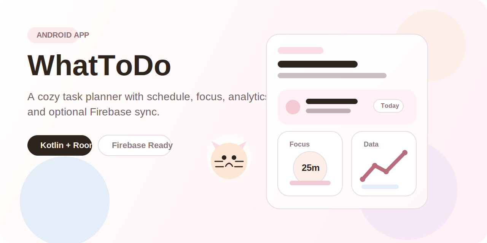
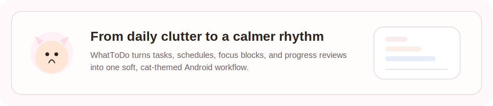
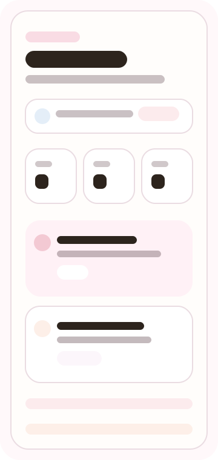
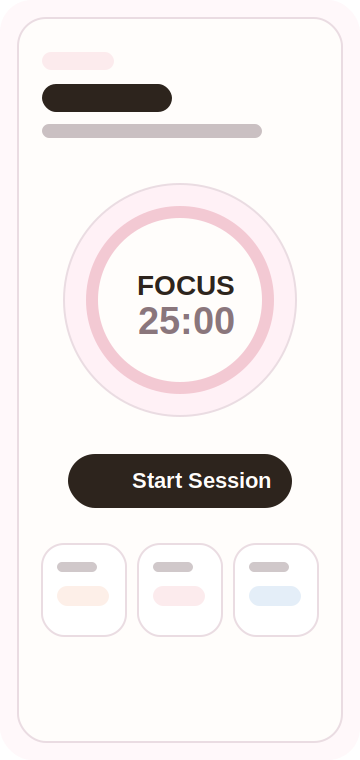
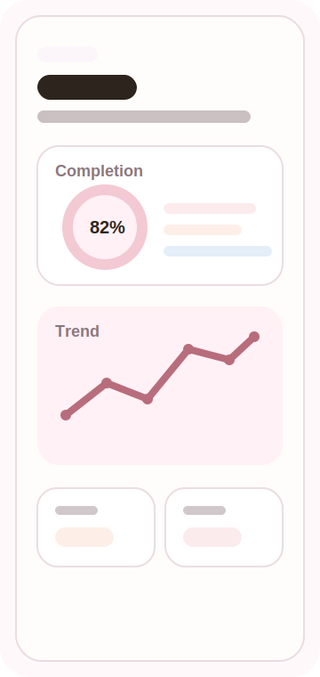
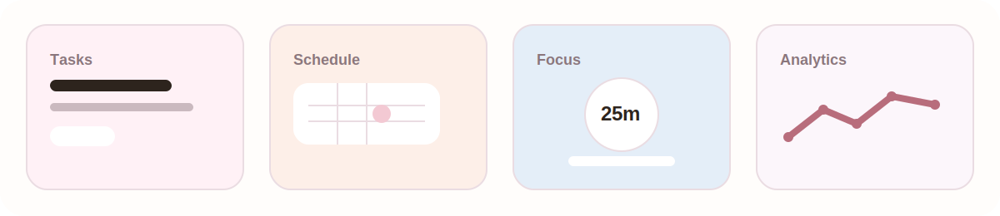
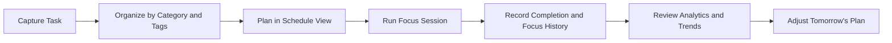
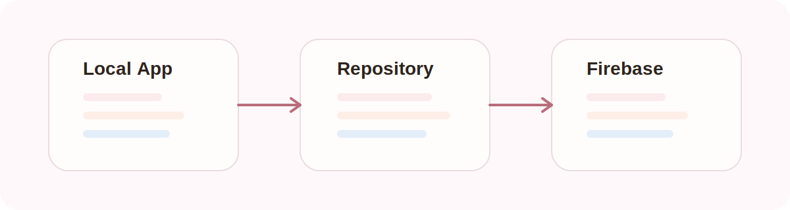
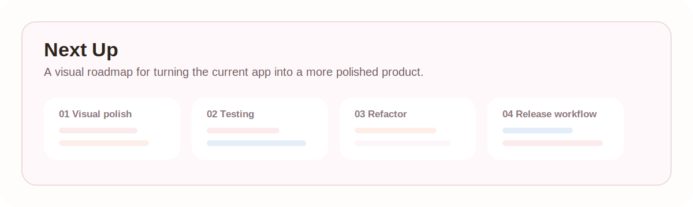
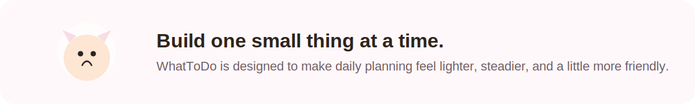

<p align="center">
  
</p>

<h1 align="center">WhatToDo</h1>

<p align="center">
  A cozy Android productivity app for planning tasks, staying focused, and reviewing progress over time.
</p>

<p align="center">
  
  
  
  
</p>

## Overview

WhatToDo is a native Android to-do app designed around a softer, less stressful productivity flow. Instead of acting like a plain checklist, it combines daily planning, schedule browsing, focus sessions, and progress analytics in one app experience.

The current project is built with Kotlin, Android Views, Room, Coroutines/Flow, and optional Firebase support for Google sign-in plus cloud sync.

<p align="center">
  
</p>

## Preview

<p align="center">
  
  
  
</p>

> These preview panels are README illustrations based on the current app structure and UI direction. They can be replaced with device screenshots later without changing the section layout.

## Core Experience

<p align="center">
  
</p>

- Organize tasks with title, notes, due date, category, tags, and repeat rules
- Filter and search tasks quickly from the home screen
- Browse schedules by month and inspect a selected day in more detail
- Start focus sessions with preset or custom cycles
- Review focus session history
- Track completion and focus activity from the analytics dashboard
- Optionally sign in with Google and sync data through Firebase / Firestore

## Feature Flow



## Screens and Modules

| Area | What it does | Main implementation |
| --- | --- | --- |
| Home | Create, edit, search, filter, and complete tasks | `HomeFragment` in `MainActivity.kt` |
| Schedule | Browse monthly calendar and inspect daily tasks | `BrandTabFragment` with `Kind.SCHEDULE` |
| Focus | Run timed focus cycles and log sessions | `FocusFragment.kt` |
| Data | Show completion rate and trend analytics | `BrandTabFragment` with `Kind.DATA` |
| Settings | Google account binding and Firebase sync actions | `BrandTabFragment` with `Kind.SETTINGS` |

## Tech Stack

- Kotlin
- Android Views + Material Components
- Room for local persistence
- Kotlin Coroutines + Flow
- Firebase Authentication
- Firebase Firestore

## Architecture Notes

<p align="center">
  
</p>

- `ShellActivity.kt` hosts the bottom navigation shell
- `MainActivity.kt` contains the home/task-management fragment implementation
- `BrandTabFragment.kt` handles schedule, analytics, and settings experiences
- `FocusFragment.kt` owns focus timer behavior and session logging
- `TaskRepository.kt` centralizes local data access, analytics shaping, and cloud sync orchestration

## Project Structure

```text
app/src/main/java/com/example/whattodo/
|- ShellActivity.kt
|- MainActivity.kt
|- BrandTabFragment.kt
|- FocusFragment.kt
|- TaskRepository.kt
|- FirebaseAccountManager.kt
|- FirebaseCloudSyncManager.kt
|- TaskDao.java / TaskDatabase.java / entities...
```

## Getting Started

### Requirements

- Android Studio
- JDK 11
- Android SDK installed
- Minimum SDK 24
- Target SDK 36

### Run Locally

1. Clone the repository.
2. Open the project in Android Studio.
3. Wait for Gradle sync to finish.
4. Launch the `app` configuration on an emulator or Android device.

## Firebase Setup

Firebase is optional for local development, but required for Google sign-in and cloud sync.

1. Create a Firebase project.
2. Add an Android app with package name `com.example.whattodo`.
3. Enable Google Sign-In in Firebase Authentication.
4. Enable Cloud Firestore.
5. Download `google-services.json`.
6. Place the file at `app/google-services.json` on your local machine.
7. Add your SHA-1 fingerprint in Firebase project settings.

The `google-services.json` file is intentionally ignored by git and should never be committed to a public repository.

## Development Roadmap

<p align="center">
  
</p>

- Replace README illustration panels with real device screenshots or a short demo GIF
- Split large UI classes into smaller feature-focused files
- Add unit tests for repository logic and repeat-rule calculations
- Add instrumentation tests for critical task and focus flows
- Add CI for build verification, lint, and test execution
- Improve export / backup options beyond Firebase sync

## Notes

- The app currently seeds demo or preview data to support development and UI presentation.
- Without Firebase setup, local task and focus features still work normally.

## License

No license has been added yet. If this repository will stay public, adding a license is strongly recommended.

<p align="center">
  
</p>
